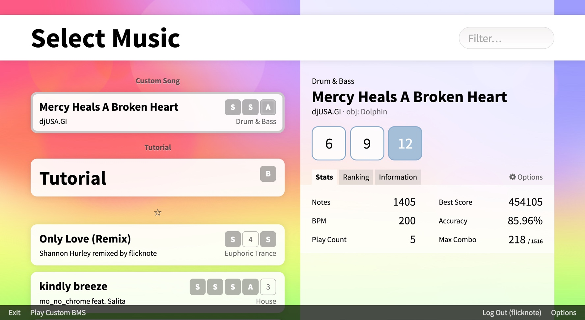
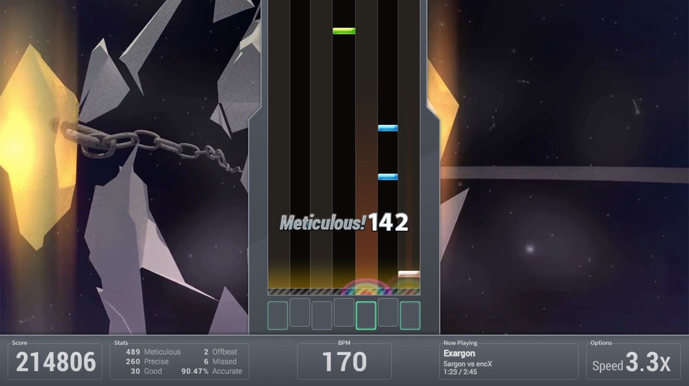
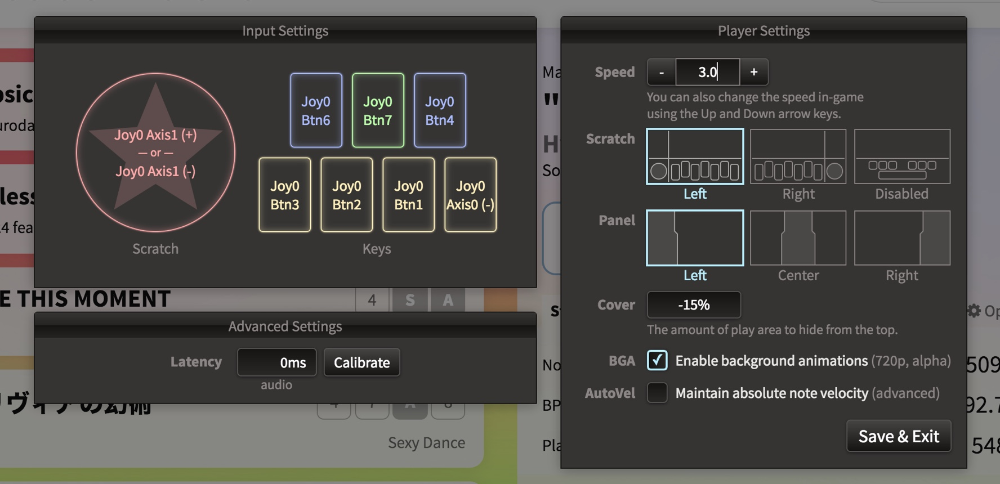

<h1 align="center"><a href="https://bemuse.ninja/"></a></h1>

<h2 align="center">open-source web-based online rhythm game</h2>

<p align="center">
  <a href="https://circleci.com/gh/bemusic/bemuse"></a>
  <a href="https://codeclimate.com/github/bemusic/bemuse"></a>
  <a href="https://codecov.io/gh/bemusic/bemuse"></a>
  <a href="https://twitter.com/bemusegame"></a>
  <br>
  <a href="https://bemuse.ninja/project"></a>
  <a href="https://david-dm.org/bemusic/bemuse" title="Dependency status"></a>
  <a href="https://david-dm.org/bemusic/bemuse#info=devDependencies" title="devDependency status"></a>
</p>

**Bemuse** is an open-source, online, web-based rhythm game. It plays songs in
BMS format (See:
[Introduction to BMS](https://www.youtube.com/watch?v=Guv1vRAKanY)).

It is recommended to play this game on Google Chrome.

**Table of contents:**

<!-- toc -->

- [Video Demo](#video-demo)
- [Quick Tour](#quick-tour)
- [Technology](#technology)
- [Development](#development)
- [Sub-projects](#sub-projects)
- [License](#license)

<!-- tocstop -->

## Video Demo

<p align="center">
  <a href="https://www.youtube.com/watch?v=EOgI37Myqvk"></a>
</p>

## Quick Tour



- You can play **online songs** instantly in your browser.

- You can play **custom songs** by dragging a folder containing BMS files into
  this screen. There are over 5,000 songs published in BMS format by the
  community worldwide. You can find them using
  [BMS Search](http://bmssearch.net/).

- There’s an **online internet ranking** system. You can compete with other
  players and see your rank online.

- It has an **insane tutorial.**



- **Keyboard mode** (7-keys). Play along the music with your keyboard.

- **Fully key-sounded.** Each note has its own sound. The music will be affected
  by your game play.

- Player together with friends using
  [**party mode.**](https://www.youtube.com/watch?v=hiJzFRIhiiA) It helps you
  start the game at the exact same time.

- **Multiple difficulties.** Each song has multiple difficulties to accommodate
  every player skill levels.

- **Adjustable speed.** You can adjust the speed (spacing) of the notes to make
  it easy-to-sightread. This does not affect the speed of the song; lowering the
  speed causes notes to become more dense on-screen.

- [**Scoring and grading system.**](http://bemuse.readthedocs.io/en/latest/users/scoring-and-judgment.html)
  Master the song to get the S grade (score over 500000).


- **BMS mode** (7-keys + turntable). You can play using an
  [IIDX controller](https://www.youtube.com/watch?v=EOgI37Myqvk) or
  [MIDI controller](https://www.facebook.com/bemusegame/videos/985712734835136/).

- **HD video support.** Some songs will have a background animation in
  high-definition (720p).

- **Adjustable play area size.** If the gameplay area is too long, you can
  adjust the cover it to make the play area more easy-to-sightread.

- **Early/Late indicator.** Bemuse will tell you if you press the note too early
  or too late.



- **Adjustable panel position.** You can position the note panel on either side
  of the screen, or put it at the center.

- **Adjustable turntable position.** You can put turntable on the left or on the
  right (BMS mode only).

- **Audio latency compensation.** Some systems may have audio latency. Bemuse
  contains a calibration system to compensate for the audio latency.

**Play now at https://bemuse.ninja/.**

## Technology

- The web application is powered by **[React](https://facebook.github.io/react/)
  and [Redux](http://redux.js.org/).**

- The game engine is powered by **[PixiJS](http://www.pixijs.com/).**

## Development

Install [Node.js](https://nodejs.org/en/) and
[Yarn](https://github.com/yarnpkg).

```
# Clone Bemuse
git clone git@github.com:bemusic/bemuse.git

# Enter the main repository
cd bemuse

# Install the dependencies
yarn

# Prepare all sub-projects
yarn lerna run prepare

# Start development server
yarn start
```

Note: Online ranking features are not available.

## Sub-projects

This repository holds the code for other sub-projects, which are available for
use on npm.

| Project name                                      | Badge                                                                                                  | Description                                                                                     |
| ------------------------------------------------- | ------------------------------------------------------------------------------------------------------ | ----------------------------------------------------------------------------------------------- |
| [**bms**](packages/bms)                           | [](http://npmjs.com/package/bms)                           | JavaScript [BMS](https://hitkey.nekokan.dyndns.info/cmds.htm) parser                            |
| [**bmson**](packages/bmson)                       | [](http://npmjs.com/package/bmson)                       | JavaScript [bmson](https://bmson.nekokan.dyndns.info/) parser                                   |
| [**bemuse-tools**](packages/bemuse-tools)         | [](http://npmjs.com/package/bemuse-tools)         | Tools for [hosting your own music server](https://bemuse.ninja/project/docs/music-server.html). |
| [**bemuse-indexer**](packages/bemuse-indexer)     | [](http://npmjs.com/package/bemuse-indexer)     | Library for scanning a directory for BMS/bmson files and generate a metadata.                   |
| [**bemuse-notechart**](packages/bemuse-notechart) | [](http://npmjs.com/package/bemuse-notechart) | Library for loading a notechart for use in game.                                                |

## License

[AGPLv3](LICENSE), for now. After the project matures, it may be released into a
more permissive license. Note that this license only applies to the main Bemuse
project, not the [sub-projects](#sub-projects), which has its own license terms
(mostly MIT).
