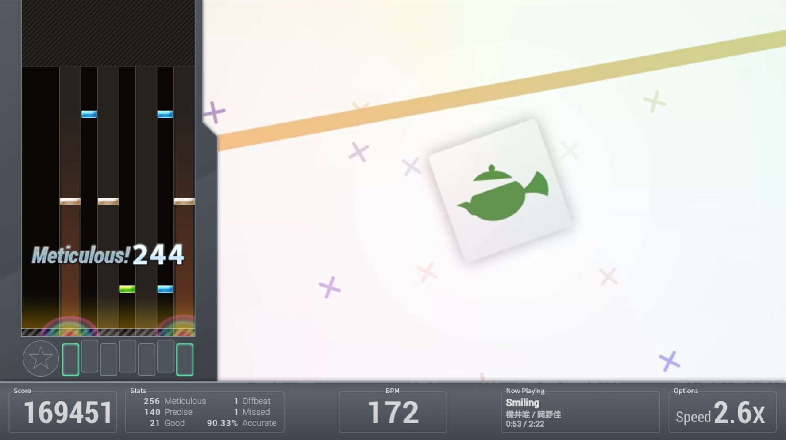

<h1 align="center"><a href="https://bemuse.ninja/"></a></h1>

<h2 align="center">open-source web-based online rhythm game</h2>

<p align="center">
  <a href="https://travis-ci.org/bemusic/bemuse"></a>
  <a href="https://circleci.com/gh/bemusic/bemuse"></a>
  <a href="https://codeclimate.com/github/bemusic/bemuse"></a>
  <a href="https://codecov.io/gh/bemusic/bemuse"></a>
  <a href="https://twitter.com/bemusegame"></a>
  <br>
  <a href="http://bemuse.rtfd.org/"></a>
  <a href="https://david-dm.org/bemusic/bemuse" title="Dependency status"></a>
  <a href="https://david-dm.org/bemusic/bemuse#info=devDependencies" title="devDependency status"></a>
</p>

__Bemuse__ is an open-source, online, web-based rhythm game.
It plays songs in [BMS format](https://www.youtube.com/watch?v=Guv1vRAKanY).

It is recommended to play this game on Google Chrome.


## Quick Tour


- You can play __online songs__ which can be played instantly.

- You can play __custom songs__ by dragging a folder containing BMS files into this screen. There are over 5,000 songs published in BMS format by the community worldwide. You can find them using [BMS Search](http://bmssearch.net/).

- There is an __online internet ranking__ which you can compete with other players online.

- It has an __insane tutorial.__ :P


- __Keyboard mode__ (7-keys). Play along the music with your keyboard.

- __Fully key-sounded.__ In Bemuse each note has its own sound. The song will be affected by your game play.

- Player together with friends with [__party mode__](https://www.youtube.com/watch?v=hiJzFRIhiiA) which helps starting the game at the exact same time.

- __Multiple difficulties.__ Each song has multiple difficulties to accommodate every player skill level!

- __Adjustable speed.__ You can adjust the speed (spacing) of the notes to make it easy-to-sightread. This does not affect the speed of the song, which means lowering the speed causes notes to become more dense on-screen.

- [__Scoring and grading system.__](http://bemuse.readthedocs.io/en/latest/users/scoring-and-judgment.html) Master the song to get the S grade (score over 500000).




- __BMS mode__ (7-keys + turntable). You can play using an [IIDX controller](https://www.youtube.com/watch?v=EOgI37Myqvk) or [MIDI controller](https://www.facebook.com/bemusegame/videos/985712734835136/).

- __HD video support.__ Some songs will have a background animation in high-definition (720p).

- __Adjustable play area size.__ If the gameplay area is too long, you can adjust the cover it to make the play area more easy-to-sightread.

- __Early/Late indicator.__ Bemuse will tell you if you press the note too early or too late.


- __Adjustable panel position.__ You can position the note panel on either side of the screen, or put it at the center.

- __Adjustable turntable position.__ You can put turntable on the left or on the right (BMS mode only).

- __Audio latency compensation.__ Some systems may have audio latency. Bemuse contains a calibration system to compensate for the audio latency.


__Play now at https://bemuse.ninja/.__


## Technology

- The web application is powered by __[React](https://facebook.github.io/react/) and [Redux](http://redux.js.org/).__

- The game engine is powered by __[PixiJS](http://www.pixijs.com/).__


## Development

Install [Node.js](https://nodejs.org/en/) and [Yarn](https://github.com/yarnpkg).

```
# Create a folder for Bemuse
mkdir Bemuse
cd Bemuse

# Clone Bemuse and music server (warning, very large repo!!)
git clone git@github.com:bemusic/bemuse.git
git clone git@github.com:bemusic/music.git

# Enter the main repository
cd bemuse

# Install the dependencies
yarn

# Start development server
npm start
```

Note: Online ranking features are not available.


## License

[AGPLv3](LICENSE), for now.
After the project matures, it may be released into a more permissive license.
