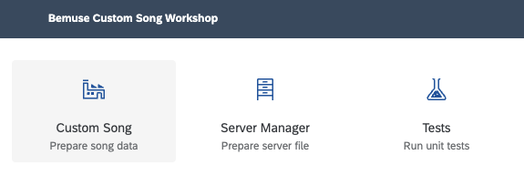
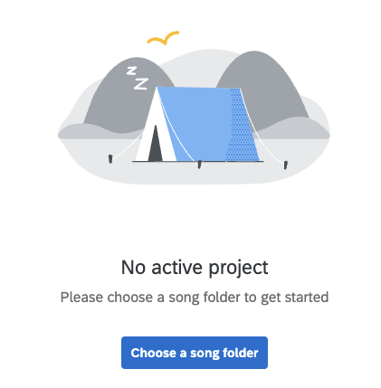
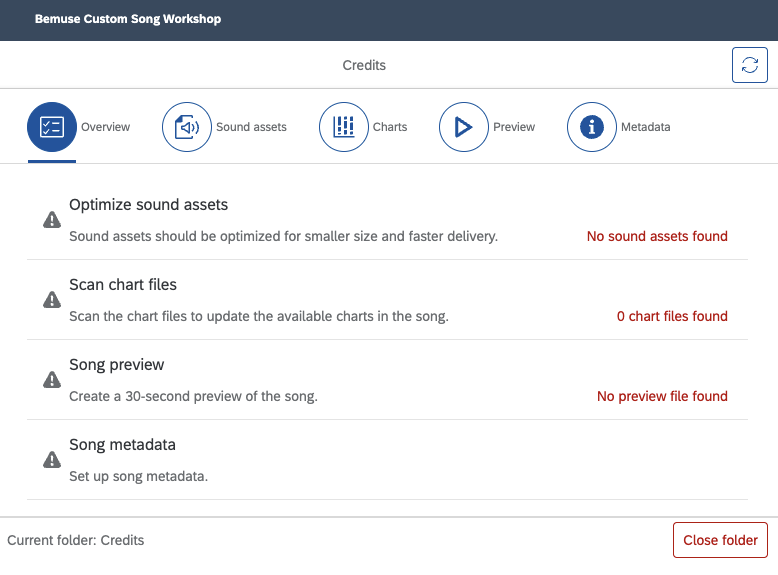
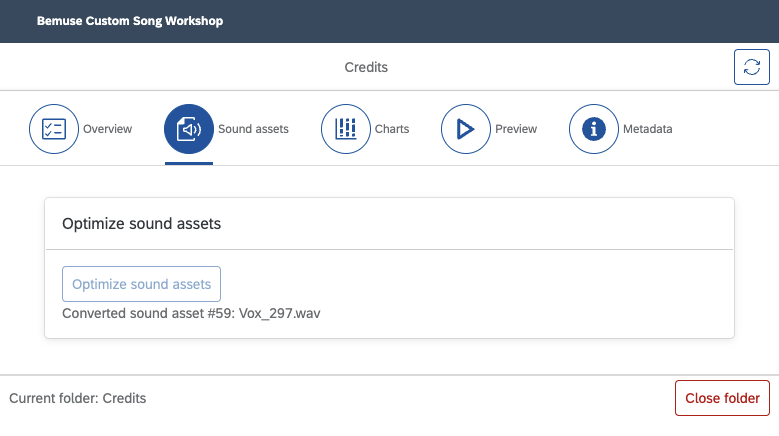
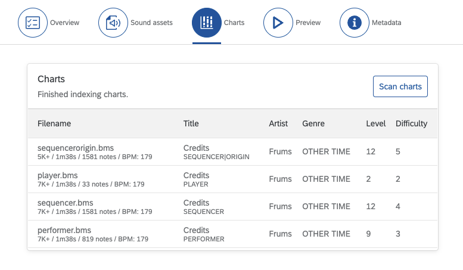
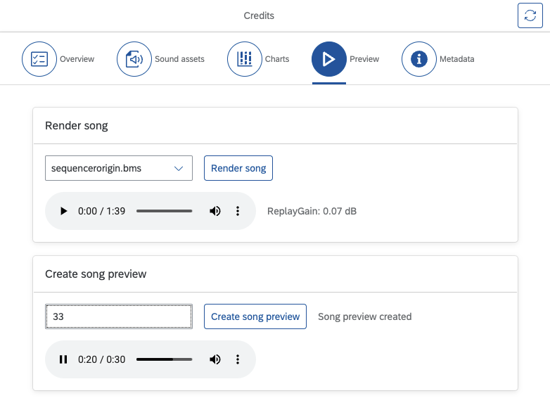

Bemuse comes with a default Music Server to help new players get started. This
Default Music Server contains a curated selection of developer’s favorite songs.

This guide will cover:

1. How to prepare a BMS song for playing in Bemuse.
2. How to test it with Bemuse.
3. How to publish them as Music Servers.

## What you need

- The BMS package(s) that you want to put on the music server.
- A web hosting provider that can be configured to
  [enable CORS](https://enable-cors.org/index.html).
- Google Chrome or Microsoft Edge web browser.

## The song workshop application

Using Google Chrome or Microsoft Edge, go to the Bemuse Song Workshop
application at this URL:

<https://song-workshop.bemuse.ninja/>

We will use this application throughout the rest of this guide.

Warning

Please note that this application is **very buggy** and the developer currently
does not have the resources to provide support. However if you are a developer,
you can
[find the source code on GitHub](https://github.com/bemusic/song-workshop). If
you managed to fix some issues, pull requests are welcome.

## Preparing song data

### Extract the song

First, extract the BMS song into a folder.

### Open the folder in Song Workshop

- In Song Workshop, select **Custom song**.

  <figure>

  

  </figure>

- Click **Choose a song folder** and select the extracted folder.

  <figure>

  

  </figure>

- You will see the dashboard.

  <figure>

  

  </figure>

### Optimize sound assets

- Go to the **Sound assets** tab.

- Click **Optimize sound assets**.

- Wait until finished. Depending on the song and your internet speed, this may
  take several minutes.

  <figure>

  

  </figure>

- You will also see the a new subfolder: `bemuse-data/sound`.

### Generate a chart listing

- Go to the **Charts** tab.

- Click on **Scan charts**.

- After this is finished, you should see a list of charts.

  <figure>

  

  </figure>

- You will also see the a new file in the song folder: `bemuse-song.json`.

### Generate a song preview

- Go to **Preview** tab.

- Select a chart to generate a preview. Usually I pick the medium-difficulty
  chart.

- Click **Render song** and wait until finished. This will render the selected
  chart into a high-quality OGG file.

- Listen to the song and choose starting point of the song preview. Song
  previews are always 30 seconds long.

- Put in the seconds number and then click **Create song preview**.

- Review the song preview and make appropriate adjustments.

  <figure>

  

  </figure>

### Add song metadata

- Go to the **Metadata** tab.
- Add the missing metadata as available.

- Click **Save song metadata** to save the metadata in the song folder as
  `bemuse-song.json`.

### Add eyecatch image and background image

Add these two files:

- `eyecatch_image.png` — Displayed while loading the song.
- `back_image.png` — Displayed while the song is playing in the background.

### Clean up files

Since all sound assets have been optimized and Bemuse does not use image BGA
files, we can delete these files:

- `*.ogg` `*.wav` — Keysound files
- `*.png` `*.bmp` `*.jpg` — BGA files
- `*.wmv` `*.avi` `*.mpg` — Video files

In the end, the following files should remain:

- `*.bms` `*.bme` `*.bml` `*.bmson` — BMS/bmson chart files
- `bemuse-song.json` — Metadata file
- `bemuse-data` — Optimized data folder

## Test your song locally

To test your song locally,

- Launch **Bemuse**.
- Drag the song folder into **Custom BMS** dialog.

Bemuse will detect `bemuse-song.json` and load the song. You should hear the
song preview.

## Upload your song

Upload the song folder to a hosting service. Obtain the URL to the
`bemuse-song.json` file.

## Test your song online

To test your song locally,

- Copy the URL of `bemuse-song.json` to the clipboard.
- Launch **Bemuse**.
- Open the **Custom BMS** dialog.
- Press **Cmd+V** or **Ctrl+V** to paste the URL.

If you can play the song, then congratulations! It is now ready to be published
in a Music Server.

## Create a music server

- Go to the Bemuse Song Workshop app.
- Select **Server Manager**.
- Click **Create a new server file**.
- Create an empty directory for the server and save the `index.json` file there.
- Paste in the URL of `bemuse-song.json` file.
- Click **Add**. The URL should be added to the list.
- Click **Scan songs**.
