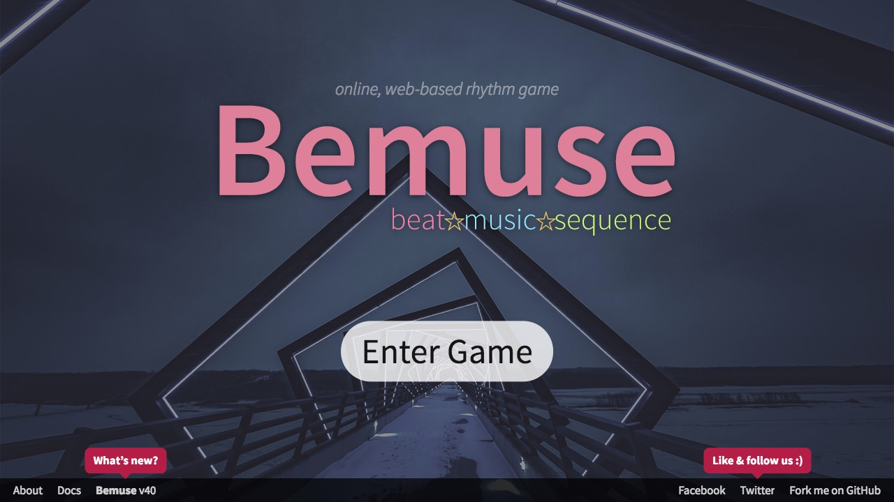
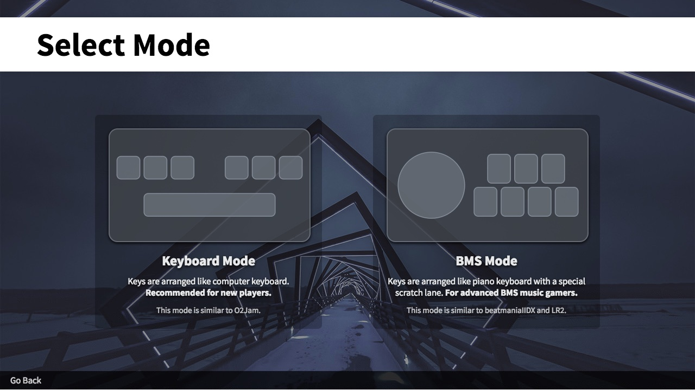
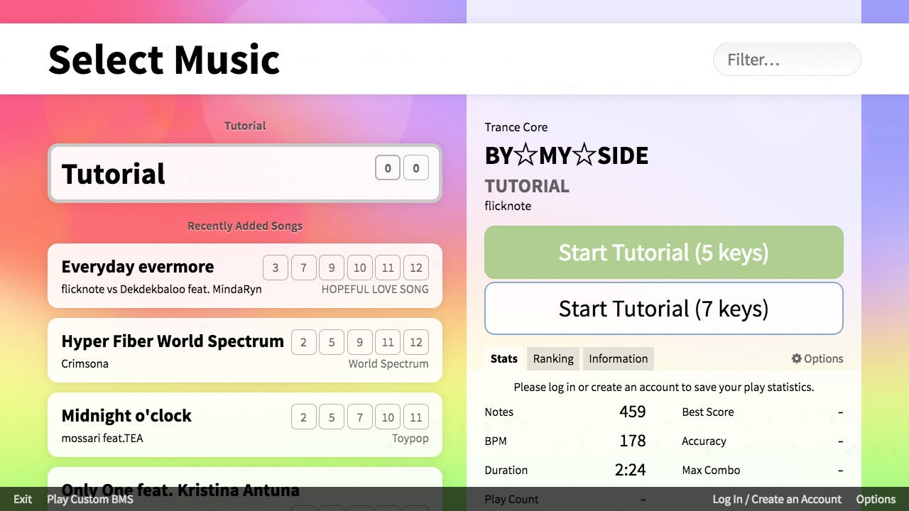
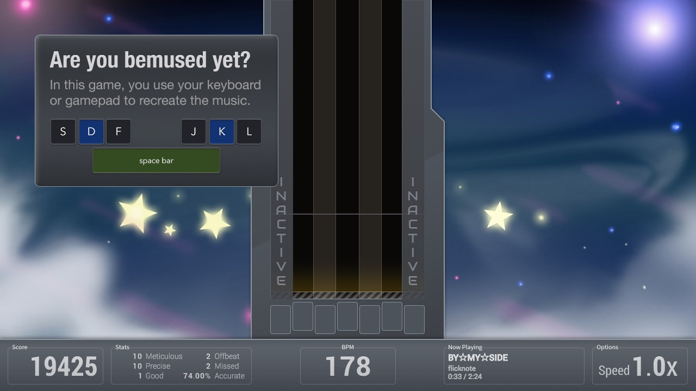
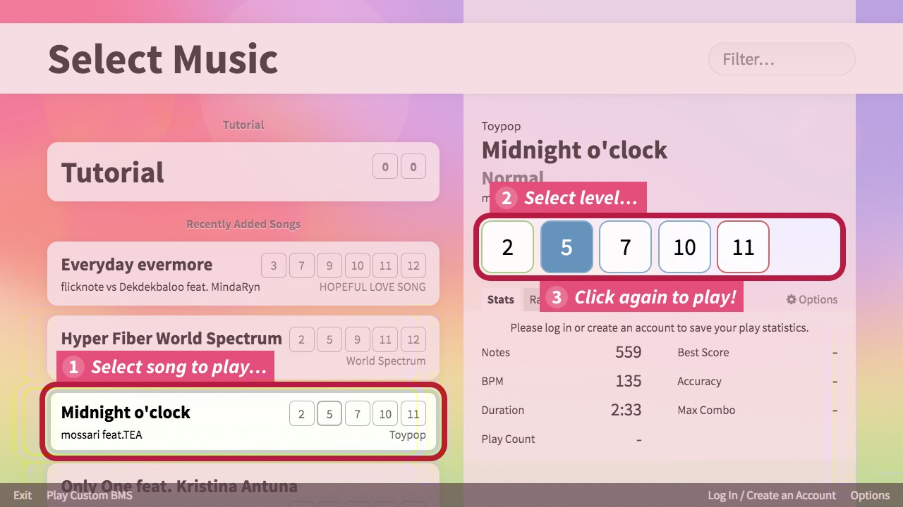
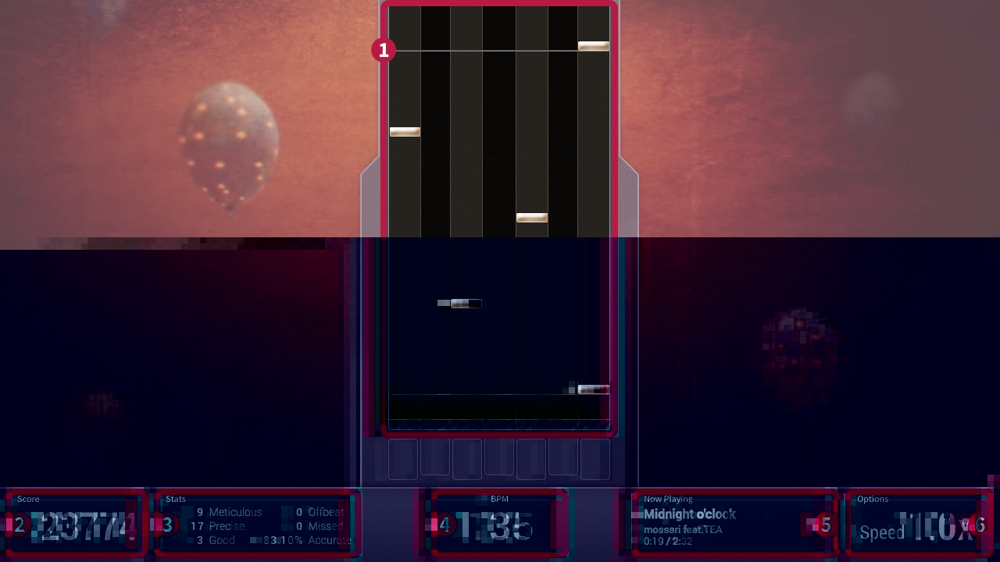
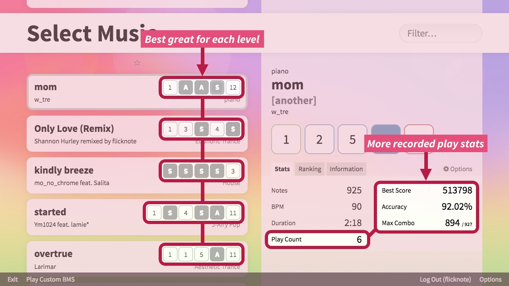

Bemuse is a web-based, online rhythm action game.

In this game, notes fall down from the top of the screen. When they reach the
bottom of the play area, you have to press the corresponding button. Hit the
notes correctly to recreate the song!

## Entering the game

Go to [bemuse.ninja](https://bemuse.ninja/) in your web browser. You will see
the title screen:

Supported web browsers include:

* Google Chrome (latest version)
* Mozilla Firefox (latest version)
* iOS Safari
* Android Chrome (Oreo and above)

Click the **Enter Game** button.

## Select game mode

Next, you will see the **game mode selection screen.**

Select the game mode you want to play. If you are a newcomer, select the
**Keyboard Mode**.

## Music selection screen

Next, you will the **music selection screen**, containing a list of songs:

## Try out the tutorial

The first song in the list is the **Tutorial.** Click the **“Start Tutorial (5
keys)”** button to start it:

The tutorial will start loading. Once the tutorial is loaded, press
<kbd>Enter</kbd> to begin the game.

The tutorial will then teach you some basic gameplay. While inside the game, you
can press the <kbd>Esc</kbd> key a couple of times to exit the tutorial.

As the tutorial probably has taught you, the levels in this game can range all
the way from BEGINNER to INSANE.

## Play more songs

Now you can start playing more songs!

1.  Select the song you want to play.
2.  Select the chart by clicking on it.
3.  Click on that chart again to play it.

## Gameplay

After the song finish loading, press <kbd>Enter</kbd> to begin playing the song.

There are many elements in the gameplay screen:

1.  The **notes area,** where notes will appear.

2.  The **score** of your game play. The more accurate you play, the more score
    you get! The maximum score for every level is 555555.

3.  The **stats** box contains the information about your accuracy.

4.  The **BPM indicator** shows how fast the song is, measured in beats per
    minutes.

5.  The **now playing** box shows the information about the current song.

6.  The **options** box shows the note speed.

### Exiting game and restarting game

While in game, you can use these keys to exit or restart the game:

| Key            | Action            |
| -------------- | ----------------- |
| <kbd>Esc</kbd> | Exit the game.    |
| <kbd>F1</kbd>  | Restart the game. |

## Adjusting note speed

As you play higher-level songs, notes becomes more dense and it becomes harder
to read the notes and time them correctly.

To make it easier to read the notes, you can increase the **note speed.** The
note speed multiplier makes note fall down faster, but it also means notes are
more spaced apart:

To adjust the note speed in-game, use these keys:

| Key                                                 | Action                       |
| --------------------------------------------------- | ---------------------------- |
| <kbd>&uarr;</kbd> (Arrow Up)                        | Increase note speed by 0.5x. |
| <kbd>&darr;</kbd> (Arrow Down)                      | Decrease note speed by 0.5x. |
| <kbd>Alt</kbd>-<kbd>&uarr;</kbd> (Alt + Arrow Up)   | Increase note speed by 0.1x. |
| <kbd>Alt</kbd>-<kbd>&darr;</kbd> (Alt + Arrow Down) | Decrease note speed by 0.1x. |

## Result screen

After finishing a song, you will see the result screen:

1.  The **Result Table** shows the results of your game play:

    * The first 5 rows show how many notes you hit or missed.

    * The **Max Combo** shows the highest streak of note hits.

    * The **Accuracy** shows how accurate you played in percentage. Click on
      this number to see more detailed information.

    * The **Total Score** shows the final score of your performance.

    For more information, see the dedicated page on
    [Scoring and Judgment](./scoring-and-judgment.md).

2.  The **Grade** shows the result grade calculated from the score, according to
    the grading table:

    | Grade | Minimum Score |
    | ----- | ------------: |
    | F     |             0 |
    | D     |        300000 |
    | C     |        350000 |
    | B     |        400000 |
    | A     |        450000 |
    | S     |        500000 |

3.  The statistical number at the bottom left shows the _mean_ and _standard
    deviation_ values for your gameplay. This is for advanced players.

4.  The **Continue** button takes you back to Music Selection Screen.

5.  The **Twitter** button lets you share your score on Twitter.

6.  Click on the **Chart Level** to play this level again.

7.  The **Leaderboard** shows the top scorers of this level. You have to login
    or register in order to save your score and have it ranked on the
    leaderboard.

### View the accuracy data

You can click on the accuracy number to see detailed **accuracy data.**

This accuracy data is calculated from the **delta time** of each note, measured
in milliseconds.

* If you hit the note too early, the delta time for that note is negative.
* If you hit the note too late, the delta time for that note is positive.

The numbers at the top shows how many notes you hit too early or too late to get
the best (Meticulous) judgment. The histogram shows the distribution of the
delta times. Finally, the numbers at the bottom shows the statistical
[accuracy and precision](https://en.wikipedia.org/wiki/Accuracy_and_precision)
of your gameplay.

## Adjusting options

You can access the options panel from the Music Selection Screen by clicking the
**Options** button.

The **Player Settings** lets you customize the in-game experience.

* **Speed** lets you control the note speed modifier. You can also
  [adjust the speed in-game](#adjusting-note-speed).

* **Scratch** lets you decide whether and where to put the turntable lane in the
  game. If turntable lane is active, it’s called **BMS Mode**. Otherwise, it’s
  the normal **Keyboard Mode**. Since different modes results in different
  number of notes, they are considered different levels and have a different
  leaderboard.

* **Panel** lets you pick where to place the panel. The **3D** placement is only
  available in Keyboard Mode (turntable lane will have to be deactivated).

* Some people find the play area too high, making it hard to read the notes.
  **Cover** lets you cover part of the play area, in case it is too high. It
  [helps you concentrate more](https://www.facebook.com/bemusegame/photos/a.872468499492894.1073741828.815335081872903/956741924398884/?type=3&permPage=1)
  on the notes at the bottom of the screen. _Not compatible with 3D mode._

* **BGA** lets you turn the background animations on and off.

* Each song have different tempo, and therefore notes scroll at a different
  speed. **AutoVel** (auto-velocity), when turned on, automatically adjusts the
  note speed modifier so that the note scrolling speed is the same as the last
  song, regardless of song tempo. The Speed option also changes into
  **LeadTime** which lets you specify how long it should take for the note to
  scroll across the screen.

* **Gauge**, when turned on, displays a score gauge at the top of the screen. If
  the gauge runs out the first time, then you missed your chance to get the ‘S’
  grade. If the gauge runs out the second time, then you missed your chance to
  get the ‘A’ grade.

* **Preview** music can be turned on and off.

The **Input Settings** lets you choose which keys you will use to hit the note
in each column.

The **Advanced Settings** lets you set up the game to compensate for audio
latency.

## Ranking system

Bemuse has its own **internet ranking system.**

To get started, find the **“Log In / Create an Account”** button at the bottom right of the music selection screen:

Create an account or log in:

When you are logged in, your play statistics are saved automatically,
and you can view them in the music selection screen:

You can also find the ranking table in the ranking tab:

<!--
@todo #473 Add a section about playing custom songs.
-->
