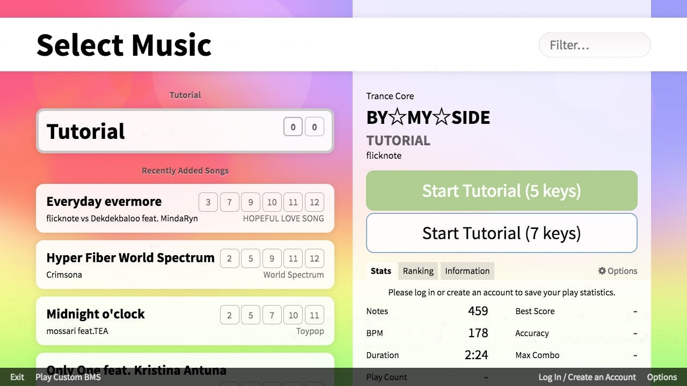

Bemuse is a web-based, online rhythm action game.

In this game, notes fall down from the top of the screen. When they reach the
bottom of the play area, you have to press the corresponding button. Hit the
notes correctly to recreate the song!

## Entering the game

Go to [bemuse.ninja](https://bemuse.ninja/) in your web browser. You will see
the title screen:

Supported web browsers include:

* Google Chrome (latest version)
* Mozilla Firefox (latest version)
* iOS Safari
* Android Chrome (Oreo and above)

Click the **Enter Game** button.

## Select game mode

Next, you will see the **game mode selection screen.**

Select the game mode you want to play. If you are a newcomer, select the
**Keyboard Mode**.

## Music selection screen

Next, you will the **music selection screen**, containing a list of songs:

## Try out the tutorial

The first song in the list is the **Tutorial.** Click the **“Start Tutorial (5
keys)”** button to start it:

The tutorial will start loading. Once the tutorial is loaded, press
<kbd>Enter</kbd> to begin the game.

The tutorial will then teach you some basic gameplay. While inside the game, you
can press the <kbd>Esc</kbd> key a couple of times to exit the tutorial.

## Play more songs

Now you can start playing more songs!

1.  Select the song you want to play.
2.  Select the chart by clicking on it.
3.  Click on that chart again to play it.

## Gameplay

After the song finish loading, press <kbd>Enter</kbd> to begin playing the song.
There are many elements in the gameplay screen:

1.  The **notes area,** where notes will appear.

2.  The **score** of your game play. The more accurate you play, the more score
    you get! The maximum score for every level is 555555.

3.  The **stats** box contains the information about your accuracy.

4.  The **BPM indicator** shows how fast the song is, measured in beats per
    minutes.

5.  The **now playing** box shows the information about the current song.

6.  The **options** box shows the note speed.

## Adjusting note speed

As you play higher-level songs, notes becomes more dense and it becomes harder
to read the notes and time them correctly.

To make it easier to read the notes, you can increase the **note speed.** The
note speed multiplier makes note fall down faster, but it also means notes are
more spaced apart.

To adjust the note speed in-game:

* Press the <kbd>&uarr;</kbd> (Arrow Up) key to increase note speed by 0.5x.
* Press the <kbd>&darr;</kbd> (Arrow Down) key to decrease note speed by 0.5x.
* Press <kbd>Alt</kbd>-<kbd>&uarr;</kbd> (Alt + Arrow Up) key to increase the
  notepeed by 0.1x.
* Press <kbd>Alt</kbd>-<kbd>&darr;</kbd> (Alt + Arrow Down) key to decrease the
  notepeed by 0.1x.

## Result screen

TODO

## Adjusting options

TODO

## Ranking system

TODO

## Custom songs

TODO
