This guide will walk you through the steps of preparing a BMS song to make it
playable online in Bemuse.

While players can download a BMS archive and load it in Bemuse, preparing a song
for online play has a few extra benefits:

| Regular BMS archive played in Bemuse           | BMS prepared for online play in Bemuse              |
| ---------------------------------------------- | --------------------------------------------------- |
| Has to be downloaded in order to play          | Can be played online without downloading            |
| Displays a generic eyecatch image (※1)         | Can display a custom eyecatch image                 |
| Displays a generic background image (※1)       | Can display a custom background image               |
| BGA is not supported in Bemuse (※1)            | Can play a high-definition video file as BGA        |
| No commentary and links in the Information tab | Can add commentary and links to the Information tab |
| Different songs have different loudness        | Loudness level is normalized with ReplayGain        |
| No song preview                                | Players can hear a preview of the song in Bemuse    |

<!--
- **Convenience and speed:** Players don’t have to download the archive by
  themselves and the files are optimized so archive downloads fast over the
  internet.
- **Extra features:** You can specify an eyecatch image (displayed while the
  game is loading); a background image (shown in-game), a high-definition
  background video file (play in-game); commentaries by the artists and links to
  the songs.
- **Volume normalization:** Third, each song’s sound volume will be normalized,
  so each song will have the same overall volume.
- **Song preview:** And finally, players can preview the song before playing it.
-->

※1 — Except for `.bmson` charts where Bemuse has support for these features.

## Outline

This guide will cover:

1. How to prepare a BMS song for playing in Bemuse.
2. How to test it in Bemuse locally.
3. How to test it online in Bemuse.
4. How to publish multiple songs as Music Servers.

## What you need

- To prepare a song for online play:

  - The BMS archive to prepare.
  - Latest version of Google Chrome or Microsoft Edge web browser.

- To host a music server:

  - A web hosting provider that supports HTTPS and can be configured to
    [enable CORS](https://enable-cors.org/index.html).

## The song workshop application

Using Google Chrome or Microsoft Edge, go to the Bemuse Song Workshop
application at this URL:

**<https://song-workshop.bemuse.ninja/>**

We will use this application throughout the rest of this guide.

:::caution Warning

Please note that this application can be **very buggy** and the developer
currently does not have the resources to provide support, although Bemuse’s
developers also use this app to manage the official server. However if you are a
developer, you can
[find the source code on GitHub](https://github.com/bemusic/song-workshop). If
you managed to fix some issues, pull requests are welcome.

:::

## Preparing a song

### Extract the archive

First, extract the BMS archive into a folder.

### Open the folder in Song Workshop

- In Song Workshop, select **Custom song**.

  <figure>

  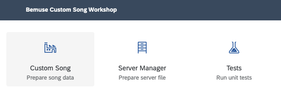

  </figure>

- Click **Choose a song folder** and select the extracted folder.

  <figure>

  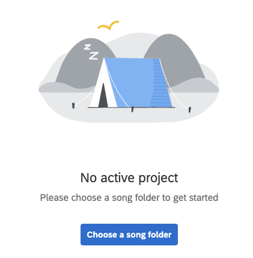

  </figure>

- You will see the dashboard.

  <figure>

  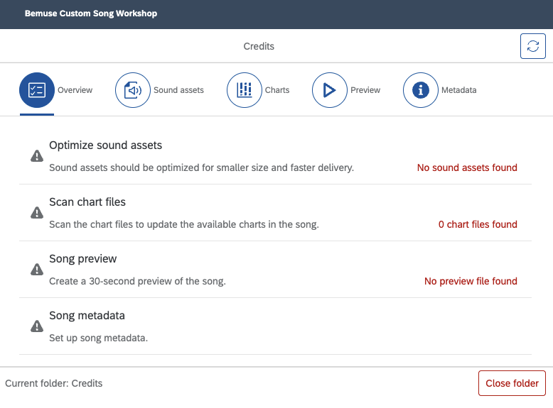

  </figure>

### Optimize sound assets

BMS archives typically contains hundreds of sound files. Downloading many small
files on the web can be slow. By optimizing sound assets, all sounds will be
compressed as `.ogg` files and then bundled up into `.bemuse` files.

- Go to the **Sound assets** tab.

- Click **Optimize sound assets**.

- Wait until finished. Depending on the song and your internet speed, this may
  take several minutes.

  <figure>

  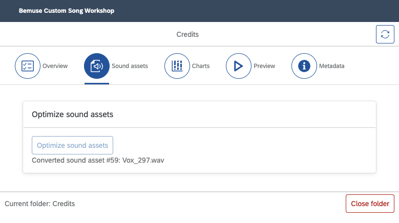

  </figure>

- You will also see the a new subfolder `bemuse-data/sound` with optimized
  files.

  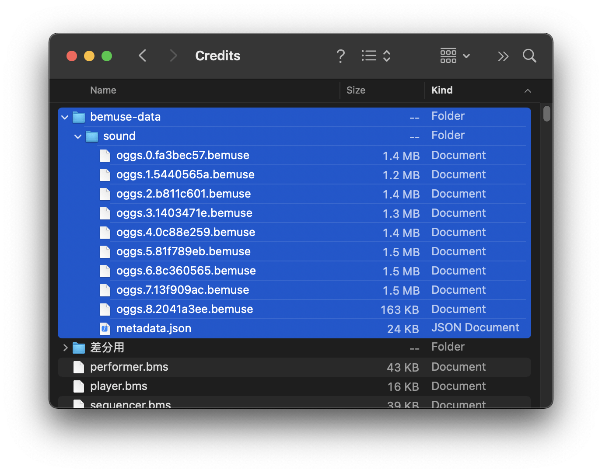

### Generate a metadata file

Normally, the BMS song folder must be scanned to search for available chart
files (`.bms` `.bme` `.bml` `.bmson`), and each chart file must be parsed to
obtain the metadata. However, it is not practical on the web to scan directories
and read each file. Therefore, for online songs Bemuse requires a metadata file
which contains information about the song and all its available charts.

- Go to the **Charts** tab.

- Click on **Scan charts**.

- After this is finished, you should see a list of charts.

  <figure>

  

  </figure>

- You will also see the a new file in the song folder: `bemuse-song.json`.

  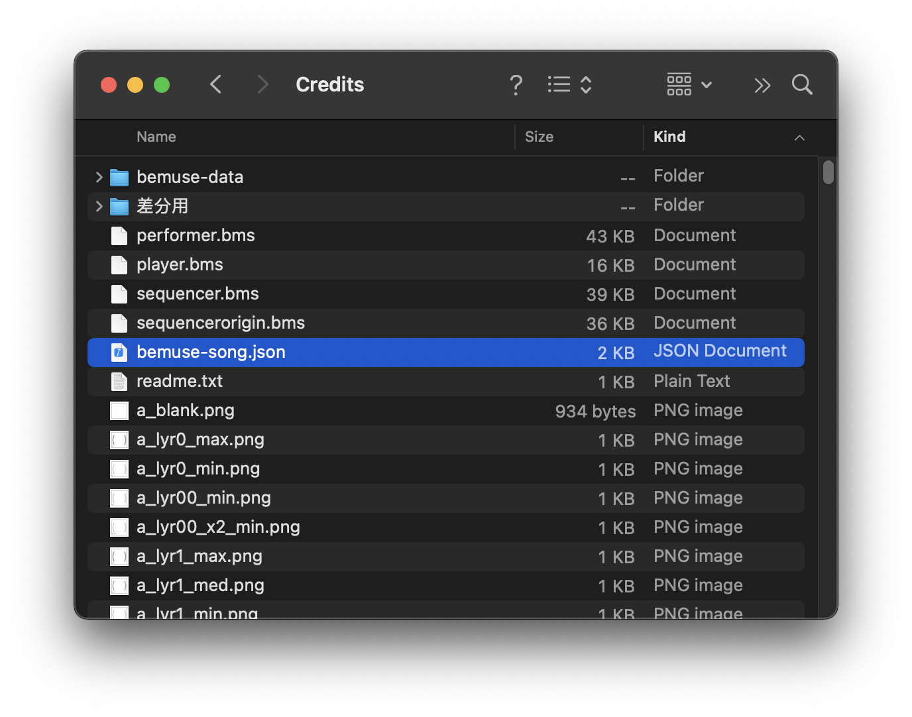

### Generate a song preview

Generating a song preview allows player to listen to an excerpt of the song in
the Music Selection screen.

- Go to **Preview** tab.

- Select a chart to generate a preview. Usually I pick the medium-difficulty
  chart.

- Click **Render song** and wait until finished. This will render the selected
  chart into a high-quality OGG file. This process will also analyze the song’s
  loudness and save it to the song’s metadata.

- Listen to the song and choose starting point of the song preview. Song
  previews are always 30 seconds long.

- Put in the seconds number and then click **Create song preview**.

- Review the song preview and make appropriate adjustments.

  <figure>

  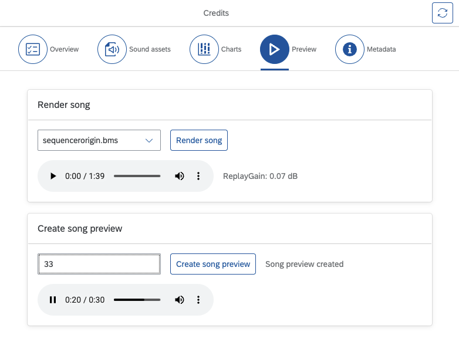

  </figure>

- New files will be created: `bemuse-data/song.ogg` and
  `bemuse-data/preview.mp3`

  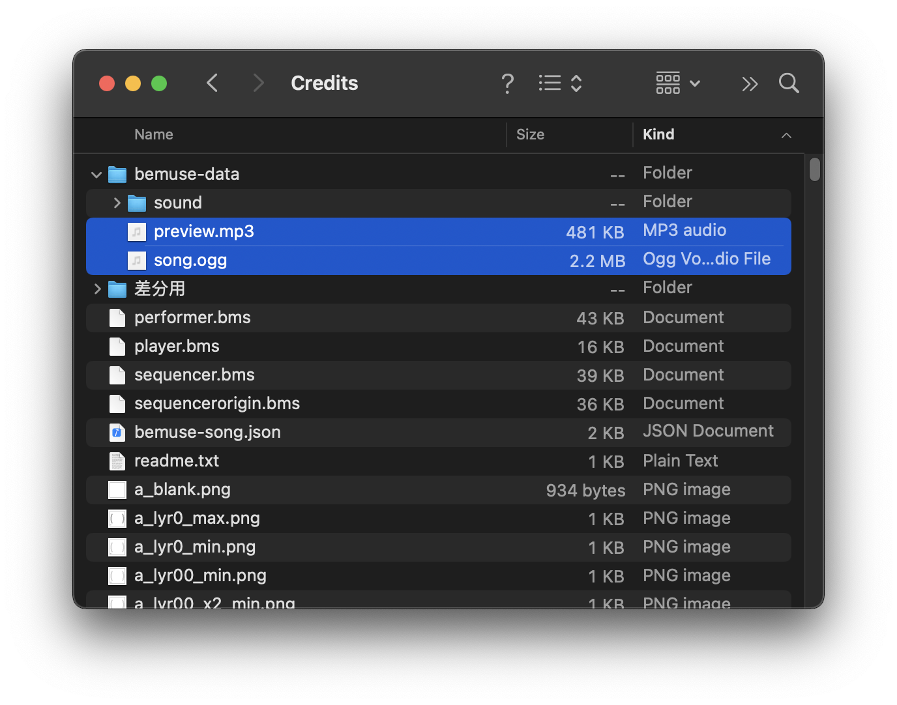

### Add more song metadata

- Go to the **Metadata** tab.

- Add the metadata and click **Save song metadata** to save the metadata in the
  song folder as `bemuse-song.json`.

  <figure>

  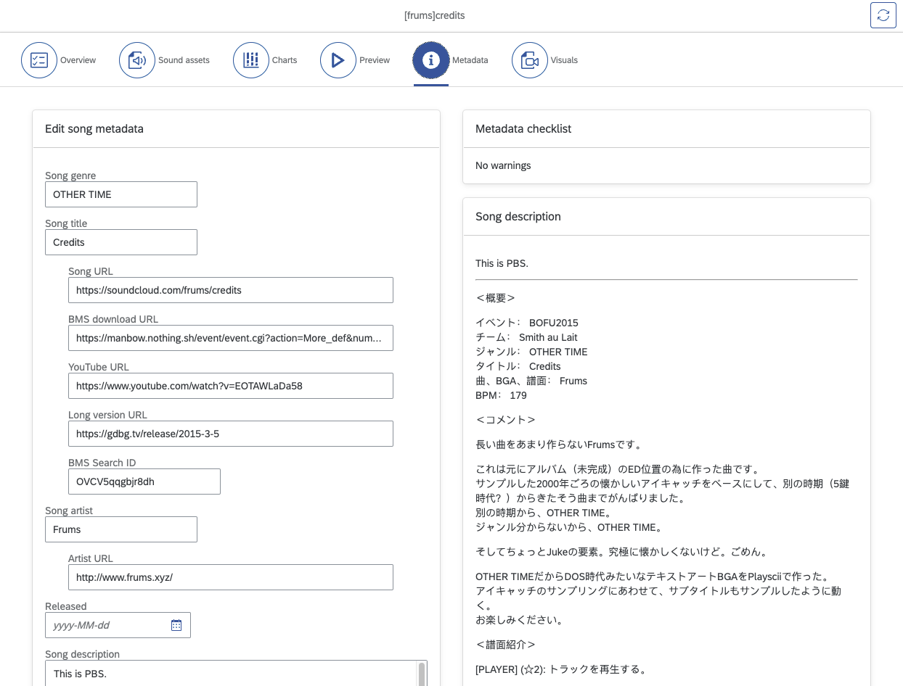

  </figure>

- The song description will be saved in `README.md`.

  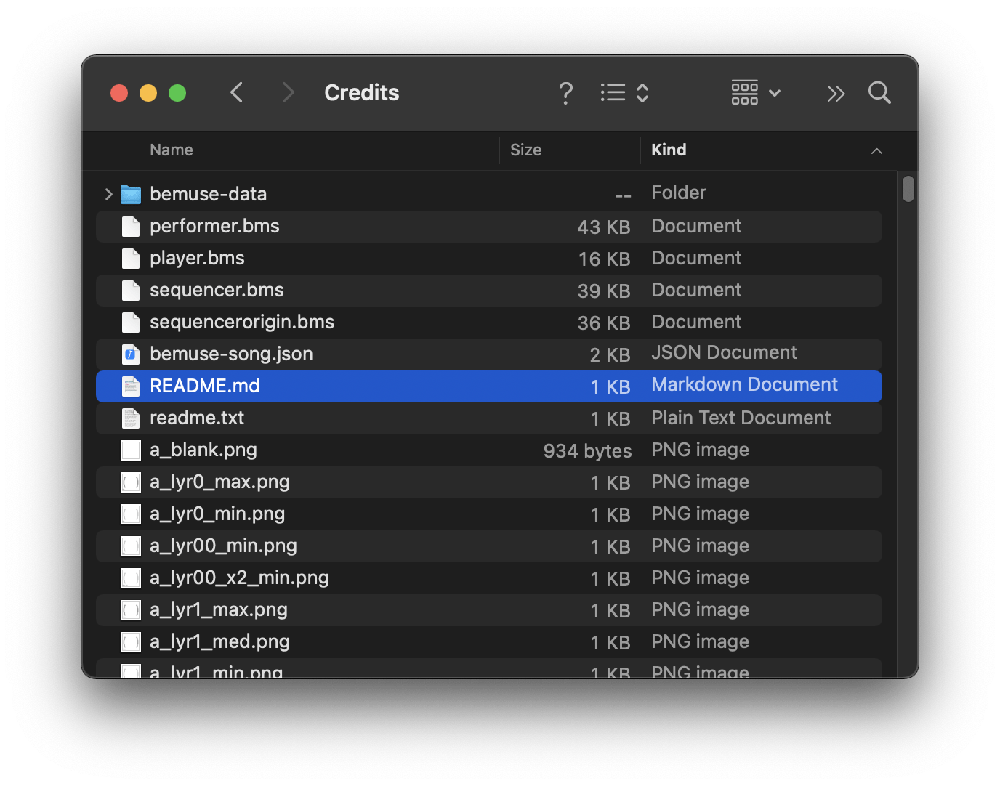

### Add image and video files

- Add these files:

  - `bemuse-data/eyecatch_image.{jpg,png}` — Displayed while loading the song.
  - `bemuse-data/back_image.{jpg,png}` — Displayed in-game.
  - `bemuse-data/bga.{mp4,webm}` — Background animation.

  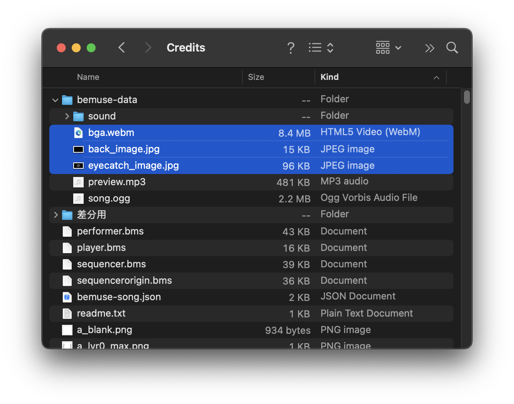

- Go to the **Visuals** tab.

- Click on the **Scan** button.

- You should see the images and video files displayed.

- For video, click on **Test Synchronization** to check if the video and audio
  are in sync. If not, click **Set video offset** and test again.

  <figure>

  

  </figure>

### Clean up files

Now, all assets has been optimized and all necessary metadata files are created.
We can now clean up the folder to save up space.

- Delete these files:

  - `*.ogg` `*.wav` — Keysound files
  - `*.png` `*.bmp` `*.jpg` — BGA files
  - `*.wmv` `*.avi` `*.mpg` — Video files

  In the end, the following files should remain:

  - `*.bms` `*.bme` `*.bml` `*.bmson` — BMS/bmson chart files
  - `bemuse-song.json` — Metadata file
  - `bemuse-data` — Optimized data folder

  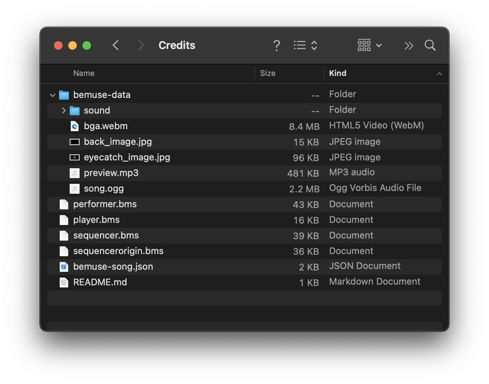

### Congratulations!

Now the song has been prepared for online play. The next step is to test your
song locally in Bemuse.

## Test your song locally

To test your song locally,

- Launch **Bemuse**.
- Drag the song folder into the **Custom BMS** dialog.

Bemuse will detect `bemuse-song.json` in the folder and load the song. You
should hear the song preview, see the images, video, and other information.

## Upload your song

Now that your song is prepared and tested, it’s time to put it online!

- Upload the song folder to a hosting service.

  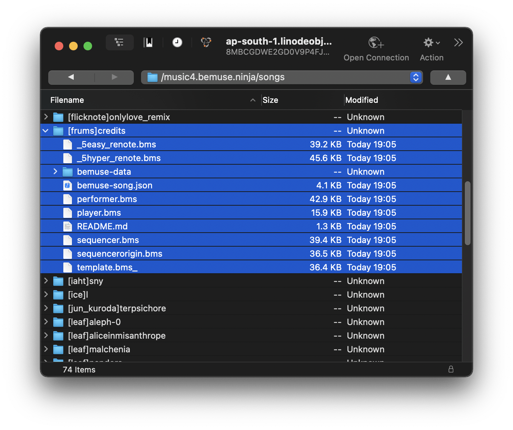

- Obtain the URL to the `bemuse-song.json` file.

  - For example:
    <https://music4.bemuse.ninja/songs/[frums]credits/bemuse-song.json>

## Test your song online

Now that your song is online, you can test it!

- Go to
  <code>https:/<i></i>/bemuse.ninja/?server=<em>&lt;url/to/bemuse-song.json&gt;</em></code> 

  - For example:
    <https://bemuse.ninja/?server=https://music4.bemuse.ninja/songs/[frums]credits/bemuse-song.json>

  - (Alternatively, you can launch Bemuse normally and then paste the URL into
    the Custom BMS dialog.)

If you can play the song, then congratulations! Your song has been prepared for
online play and is now online.

## Create a music server file to publish multiple songs

So far, you have created a “single-song server” which lets you select one song.
But what if you want to publish multiple songs for people to play at the same
place? In this case you would create a **music server file.**

- Go to the **Bemuse Song Workshop** app.
- Select **Server Manager**.
- Click **Create a new server file**.
- Create an empty directory for the server and save the `index.json` file there.
- Paste in the URLs of `bemuse-song.json` file.
- Click **Add**. The URL should be added to the list.
- Click **Update data**.
- Check the results.

  <figure>

  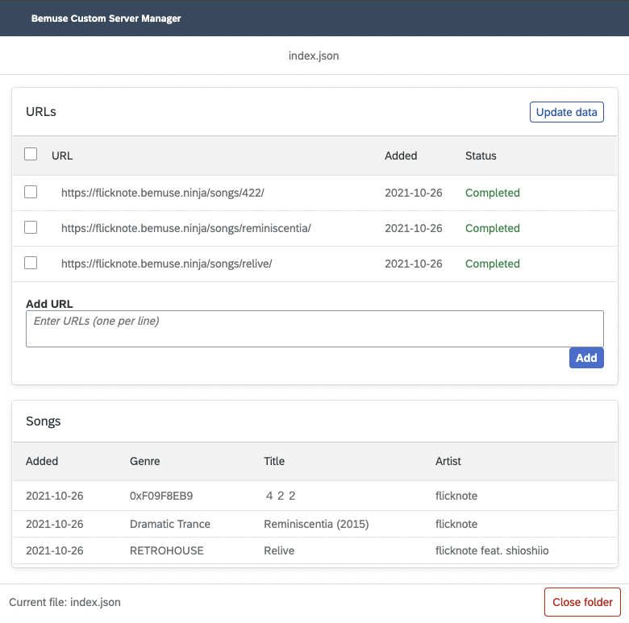

  </figure>

## Upload your music server

- Upload the `index.json` file to a hosting service.

  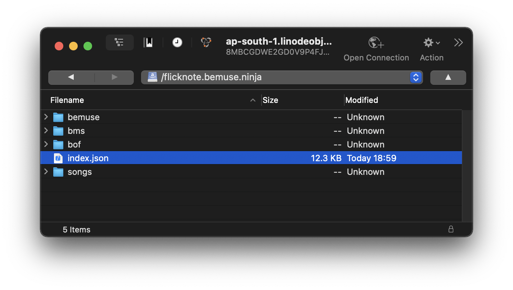

- Obtain the URL to the `index.json` file.

  - This is your **Server URL**.
  - You can remove the `/index.json` part as Bemuse will add it automatically.
  - For example, my server is at <https://flicknote.bemuse.ninja/index.json>

## Test and share your music server

Now that your music server is online, you can try it in Bemuse and share it with
your friends!

- Go to <code>https:/<i></i>/bemuse.ninja/?server=<em>&lt;Server
  URL&gt;</em></code> 

  - For example, <https://bemuse.ninja/?server=https://flicknote.bemuse.ninja>
